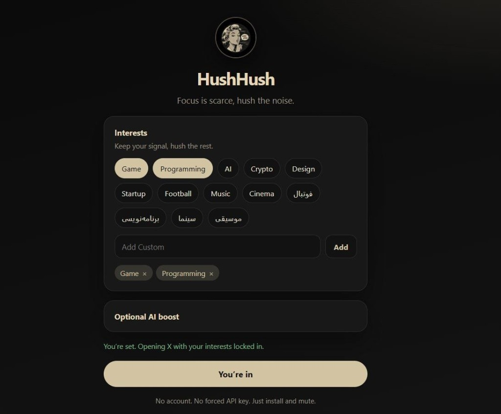
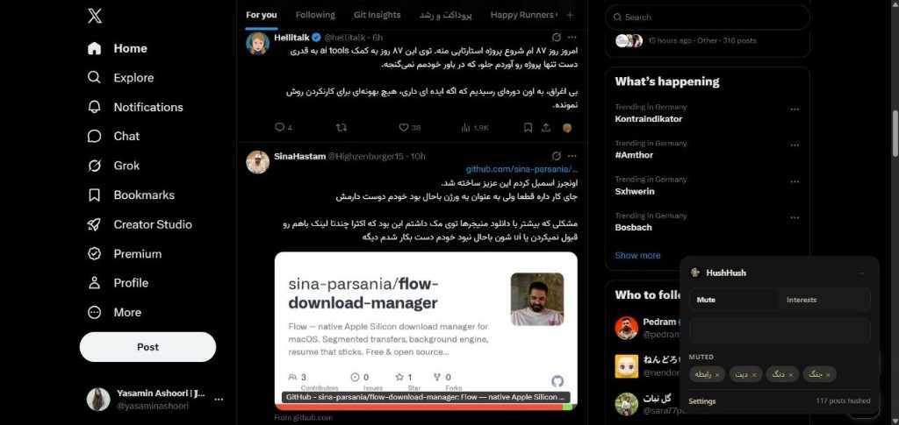

<p align="center">
  
</p>

<h1 align="center">HushHush</h1>

<p align="center">
  <em>Focus is valuable, hush the noise.</em>
</p>

<p align="center">
  <a href="LICENSE"></a>
  
  
  
</p>

<p align="center">
  Mute what you don’t want on X, Keep what you care about.<br />
  A lightweight Chrome extension - no account, keyword mode works out of the box.
</p>

<p align="center">
  
</p>

<p align="center">
  
</p>

---

## Why HushHush

X timelines get loud fast: spam, dating bait, crypto, rage posts, AI slop.  
Mute words hide exact matches. HushHush gives you a small panel on the feed so you can mute topics in any language, lock onto interests, and optionally add semantic filtering with your own LLM key.

## Features

1. Floating panel on `x.com`
2. **Mute** type a phrase, hit Enter, matching posts get hushed
3. Rotating placeholder suggestions so it’s obvious what to mute
4. **Interests** — keep Game, Programming, AI, Football, ... and hush the rest
5. Works **without** an API key (keyword mode)
6. Optional AI boost: Groq, OpenAI, OpenRouter, custom endpoint
7. One-click “hush this” on posts when AI is enabled
8. Theme-aware dark panel that fits X

## Quick start (easiest)

Anyone can install from this repo in under a minute:

1. **Download**
   - Click the green **Code** button on GitHub: **Download ZIP**  

   - Or clone:
     ```bash
     git clone https://github.com/yasaminashoori/HushHush.git
     ```
2. Unzip if needed. Keep the folder that contains `manifest.json`.
3. Open Chrome and go to:
   ```text
   chrome://extensions
   ```
4. Turn on **Developer mode** (top-right).
5. Click **Load unpacked**: select the `HushHush` folder.
6. Open [https://x.com](https://x.com) and refresh once.

You should see the **HushHush** panel at the bottom-right of the page.

> TIP: pin the extension from the Chrome puzzle icon so the popup is one click away.

## How to use

### Mute noise

1. Open the **Mute** tab on the panel  
2. Type something you don’t want (e.g. `crypto spam`, `دیت`)  
3. Press **Enter**  
4. Scroll your feed — matching posts disappear; the footer shows how many were hushed  

Click **×** on a chip to remove a mute.

### Keep interests only

1. Open the **Interests** tab  
2. Tap presets (Game, Programming, AI, …) or add a custom one  
3. Timeline focuses on those topics; everything else gets hushed  

### Optional AI (not required)

Keyword mode is enough for most people. If you want semantic mutes like “engagement bait”:

1. Open **Settings** from the panel (or the extension options page)  
2. Expand **Optional AI boost**  
3. Pick a provider (Groq is the usual free choice)  
4. Paste your API key: **Test connection** and start on X  

Keys stay in `chrome.storage` on your machine. See [PRIVACY.md](PRIVACY.md).

## Update

1. `git pull` (or download a fresh ZIP)  
2. `chrome://extensions` → **Reload** on the HushHush card  
3. Refresh X  


## Privacy

- Preferences and mute lists stay on your device  
- No HushHush backend, no analytics  
- AI mode (optional) sends post text only to the provider **you** configure  

## License

[MIT](LICENSE)

---

<p align="center">
  
  <br />
  <sub>HushHush — keep your signal, hush the rest.</sub>
</p>
